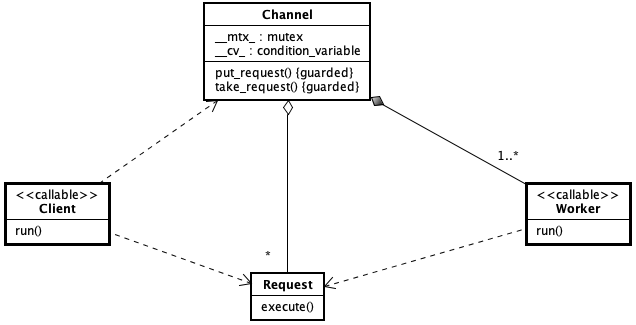

本库作者在学习了 **Java多线程设计模式 / 结城 浩著; 博硕文化译. - 北京: 中国铁道出版社, 2005.2** 一书后，用 C++ 编程语言实现了该书中提到的十二种设计模式。所有代码均在 macOS Mojave (版本10.14.6) 上通过了 clang\-1001.0.46.4 (-std=c++11) 的编译。

受限于作者对这十二种模式的理解程度、C++ 编程和 UML 建模的水平，读者如发现有任何错误或有疑问之处，请提交 issue 或发邮件联系 15040298@qq.com，本库作者将在收到意见后的第一时间里予以回复。谢谢！

> **声明：公开本库的目的是仅允许其中的代码用于学习、知识交流等非商业用途。**

## 第1章 Single Threaded Execution

### ◆ 适用性
避免因多个线程同时访问一个共享数据而破坏数据的完整性。

### ◆ 实现方案
使用 std::mutex 与 RAII（资源获取即初始化）技术相配合，定义出临界区，保证同一时间点内仅有一条线程能访问共享数据。

### ◆ 范例模型
源代码文件 [ch1/single\_threaded\_execution.cpp](ch1/single\_threaded\_execution.cpp)。

* 类图

* 顺序图

## 第2章 Immutable

### ◆ 适用性
多个线程在同时访问共享数据时，只需要读取数据而不必修改数据。

### ◆ 实现方案
无需使用锁机制，也不提供修改共享数据的应用程序接口（API）。

### ◆ 范例模型
源代码文件 [ch2/immutable.cpp](ch2/immutable.cpp)。

* 类图
 

* 顺序图

## 第3章 Guarded Suspension

### ◆ 适用性
当线程访问的共享数据没有准备好时，让该线程进入等待状态，直到数据被准备好后由其他线程唤醒在等待中的线程。

### ◆ 实现方案
使用 std::condition\_variable 对象判断共享数据是否准备好，并在准备好后唤醒等待中的线程。线程在使用 std::condition\_variable 对象之前，要在 std::mutex 上获取锁。

### ◆ 范例模型
源代码文件 [ch3/guarded_suspension.cpp](ch3/guarded_suspension.cpp)。

* 类图
 

* 顺序图

## 第4章 Balking

### ◆ 适用性
当线程访问的共享数据没有准备好时，就放弃后续的操作。

### ◆ 实现方案
在临界区中判断共享数据是否准备好。如果没有准备好，就直接退出；如果准备好了，则继续后续操作。线程进入临界区之前，要在 std::mutex 上获取锁。

### ◆ 范例模型
源代码文件 [ch4/balking.cpp](ch4/balking.cpp)。

* 类图
 

* 顺序图

## 第5章 Producer-Consumer

### ◆ 适用性
匹配数据的生产者（Producer）线程与消费者（Consumer）线程之间的处理速度。提高整体吞吐量（throughput）的同时，并保证数据的安全性。

### ◆ 实现方案
在 Producer 与 Consumer 线程之间加上一个可存放多条数据的缓冲。使用 std::mutex 锁机制保证对缓冲的临界区的互斥访问；使用 std::condition\_variable 对象让线程等待至缓冲区可访问，并在可访问后唤醒在等待中的线程。

### ◆ 范例模型
源代码文件 [ch5/producer\_consumer.cpp](ch5/producer\_consumer.cpp)。

* 类图
 

* 顺序图

## 第6章 Read-Write Lock

### ◆ 适用性
当读取共享数据的线程多于更新共享数据的线程时，提高整体的 throughput，并保证数据的安全性。

### ◆ 实现方案
在共享数据的物理锁（std::mutex）基础上，为“读”、“写”这两种操作建立不同的“逻辑锁”。使用 std::condition\_variable 对象控制允许“读”、“写”的条件。在优先“读”操作时，允许多个“读”线程访问共享数据，但让“写”线程等待。当“读”操作完成后，唤醒等待的线程，并让“写”操作优先执行。在优先“写”操作时，仅允许一个“写”线程访问共享数据，让其它的“读”、“写”线程等待。当“写”操作完成后，唤醒等待的线程，并让“读”操作优先执行。

### ◆ 范例模型
源代码文件 [ch6/read\_write\_lock.cpp](ch6/read\_write\_lock.cpp)。

* 类图
 

* 顺序图

## 第7章 Thread-Per-Message

### ◆ 适用性
当前线程将某个函数调用委托给其它线程去完成，自己可以继续后面的处理，而无需等待被委托的函数先完成。

### ◆ 实现方案
将委托的函数调用作为 std::thread 或 std::async 的启动函数，并启动一条线程。

### ◆ 范例模型
源代码文件 [ch7/thread\_per\_message.cpp](ch7/thread_per_message.cpp)。

* 类图
 

* 顺序图

## 第8章 Worker Thread

### ◆ 适用性
控制执行任务的线程的数量，进而提高计算资源的利用率。

### ◆ 实现方案
用数组或集合存放一定数量的线程，以控制线程总量。让其中的线程去处理被委托的任务。

### ◆ 范例模型
源代码文件 [ch8/worker\_thread.cpp](ch8/worker_thread.cpp)。

* 类图
 

* 顺序图

## 第9章 Future

### ◆ 适用性
当前线程将某个函数调用委托给其它线程去完成，自己可以继续后面的处理。仅在需要结果时才去获取被委托的函数的执行结果。

### ◆ 实现方案
将委托的函数作为 std::async 的启动函数。在需要结果时，调用 std::async 的返回对象 future 的 get() 函数，即可获取被委托的函数的执行结果。

### ◆ 范例模型
源代码文件 [ch9/future.cpp](ch9/future.cpp)。

* 类图
 

* 顺序图

## 第10章 Two-Phase Termination

### ◆ 适用性
保证线程接收到了终止请求后，能够尽快并安全地终止线程。

### ◆ 实现方案
定义一个标志位，表示是否终止线程；在线程执行具体任务前，先判断是否要终止当前工作。

### ◆ 范例模型
源代码文件 [ch10/two\_phase\_termination.cpp](ch10/two_phase_termination.cpp)。

* 类图
 

* 顺序图

## 第11章 Thread-Specific Storage

### ◆ 适用性
让每个线程拥有独立的变量实例，使该变量拥有与线程相同的生命周期。

### ◆ 实现方案
在声明变量时，用 thread\_local 关键字进行标记。可被声明为 thread\_local 的变量包括：命名空间范围内的变量、类的静态数据成员、局部变量这三类。

### ◆ 范例模型
源代码文件 [ch11/thread\_specific\_storage.cpp](ch11/thread_specific_storage.cpp)。

* 类图
 

* 顺序图

## 第12章 Active Object

### ◆ 适用性
封装一套运行于独立线程上、能接收外部异步消息并按需要返回处理结果的结构。

### ◆ 实现方案
组合使用 Producer-Consumer、Thread-Per-Message 和 Future 模式。将用户（作为Producer）的消息调用转换为请求对象，放入请求队列中；针对每一个请求对象启动一个独立的线程（作为Consumer）来处理（Thread-Per-Message），并将结果放入 future 中，返回给用户。

### ◆ 范例模型
源代码文件 [ch12/active\_object.cpp](ch12/active_object.cpp)。

* 类图
 

* 顺序图

